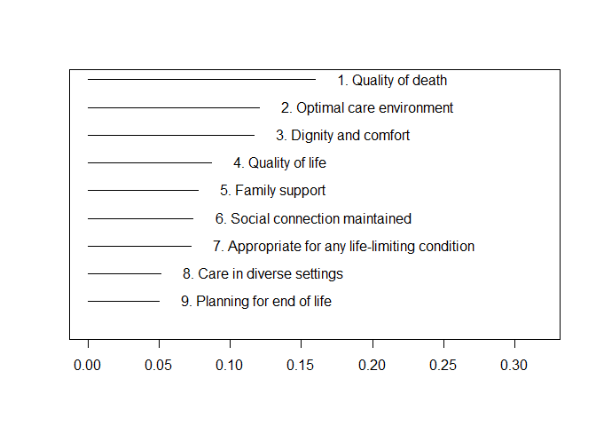
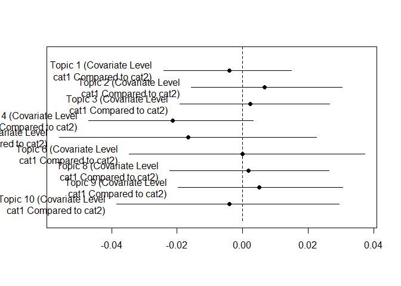
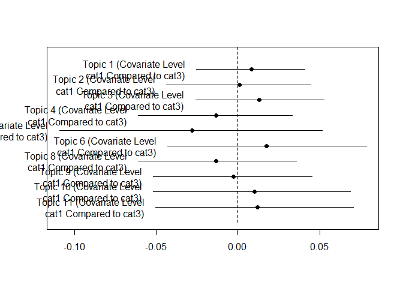
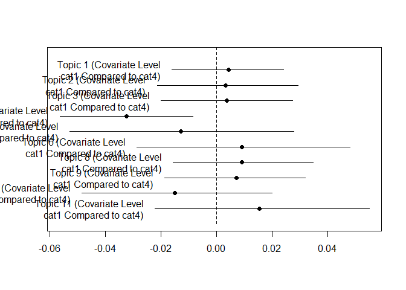
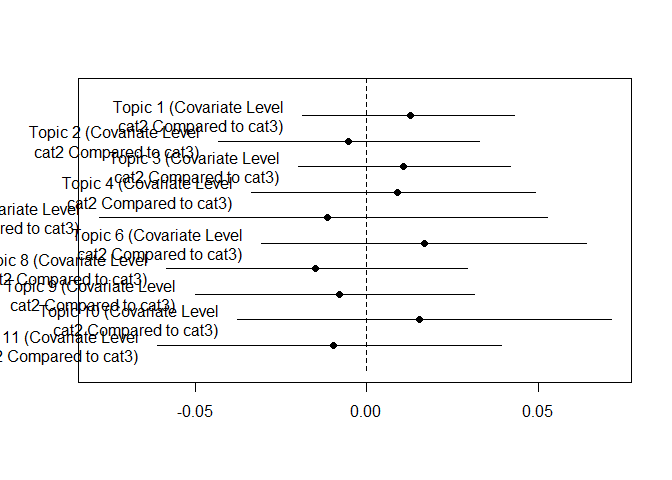
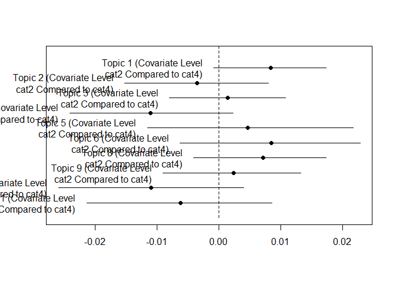
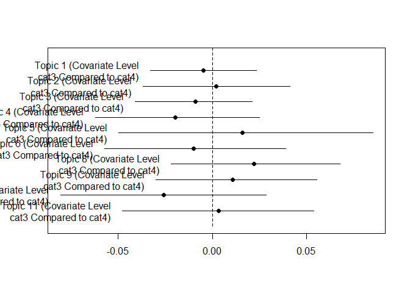

'Palliative Care Means...' MOOC discussion analysis using a structural topic model
================
Bindoff, A.
10th August 2017

Report author: Bindoff. A, <aidan.bindoff@utas.edu.au>, 2017-08-11

<!-- **Exemplars** of each modeled topic are found within student reflections and are reproduced below. These are the 6 reflections that are most representative of each topic. *'Most representative'* is defined here as the top *n* documents ranked by the proportion of weighted word 'tokens' assigned to the topic under the model (note that some exemplars will be shown as 'NA' because research consent was not given). -->
<!-- *Suggested text for Statistical Analysis section*:  -->
<!-- "In order to identify responses most representative of each topic, the “findThoughts” function from the "stm" package was used to estimate the proportion of each topic in 2014 responses compared to 2016 responses."  -->

*Figure 1. Distribution of topics*

<!-- At this point investigators are invited to identify themes within topics, and choose the best **model** by semantic meaning evident in the topics represented. Not all topics represent a coherent theme and it is acceptable to discard low-quality topics from a model. For example, if you choose a model with *k* = 15 topics, but only wish to retain 9 of those topics - that is OK. **However**, if themes are represented in *more than one topic, and some of those topics are discarded*, then it will be difficult to estimate topic proportions accurately. In this case, it is better to reduce the number of topics, *k*, to try to capture discrete themes in each modelled topic. -->
### Difference of topic distributions between cohorts, all pair-wise comparisons

