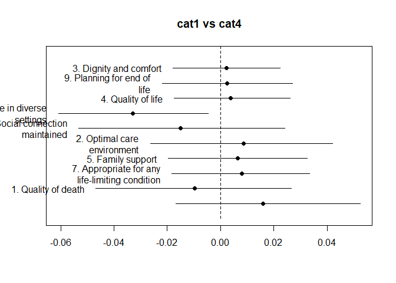
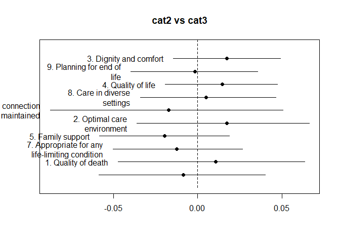

'Palliative Care Means...' MOOC discussion analysis using a structural topic model
================
Bindoff, A.
10th August 2017

Report author: Bindoff. A, <aidan.bindoff@utas.edu.au>, 2017-10-17

### Distribution of topics within corpus

### Difference of topic proportions between cohorts, all pair-wise comparisons

*p**i*, *n* − *p**j*, *n*, where *p**i*, *n* is the proportion of text from cohort *i* that is about topic *n*. Whiskers represent Bayesian 95% credible intervals.

### Estimated topic prevalence by cohort

|  cat|  topic|  mean|  2.5%CI|  97.5%CI|
|----:|------:|-----:|-------:|--------:|
|    5|      1|  0.11|   0.099|    0.111|
|    4|      1|  0.10|   0.089|    0.103|
|    2|      1|  0.10|   0.100|    0.110|
|    3|      1|  0.09|   0.058|    0.123|
|    1|      1|  0.10|   0.082|    0.125|
|    5|      2|  0.05|   0.046|    0.061|
|    4|      2|  0.06|   0.049|    0.067|
|    2|      2|  0.05|   0.047|    0.059|
|    3|      2|  0.06|   0.016|    0.100|
|    1|      2|  0.06|   0.038|    0.093|
|    5|      3|  0.08|   0.078|    0.090|
|    4|      3|  0.08|   0.072|    0.087|
|    2|      3|  0.08|   0.075|    0.086|
|    3|      3|  0.07|   0.040|    0.100|
|    1|      3|  0.08|   0.062|    0.102|
|    5|      4|  0.05|   0.039|    0.053|
|    4|      4|  0.07|   0.062|    0.083|
|    2|      4|  0.06|   0.053|    0.067|
|    3|      4|  0.05|   0.009|    0.087|
|    1|      4|  0.04|   0.016|    0.065|
|    5|      5|  0.08|   0.069|    0.090|
|    4|      5|  0.08|   0.064|    0.093|
|    2|      5|  0.08|   0.074|    0.094|
|    3|      5|  0.10|   0.035|    0.161|
|    1|      5|  0.07|   0.030|    0.105|
|    5|      6|  0.11|   0.106|    0.124|
|    4|      6|  0.11|   0.093|    0.118|
|    2|      6|  0.12|   0.107|    0.123|
|    3|      6|  0.10|   0.049|    0.147|
|    1|      6|  0.12|   0.086|    0.150|
|    5|      8|  0.08|   0.069|    0.084|
|    4|      8|  0.07|   0.062|    0.080|
|    2|      8|  0.08|   0.073|    0.086|
|    3|      8|  0.09|   0.050|    0.135|
|    1|      8|  0.08|   0.052|    0.102|
|    5|      9|  0.07|   0.064|    0.076|
|    4|      9|  0.07|   0.063|    0.082|
|    2|      9|  0.07|   0.068|    0.080|
|    3|      9|  0.08|   0.043|    0.126|
|    1|      9|  0.08|   0.053|    0.104|
|    5|     10|  0.14|   0.133|    0.152|
|    4|     10|  0.16|   0.142|    0.171|
|    2|     10|  0.14|   0.136|    0.153|
|    3|     10|  0.14|   0.085|    0.187|
|    1|     10|  0.14|   0.108|    0.180|
|    5|     11|  0.07|   0.056|    0.074|
|    4|     11|  0.06|   0.052|    0.076|
|    2|     11|  0.06|   0.052|    0.068|
|    3|     11|  0.07|   0.020|    0.124|
|    1|     11|  0.08|   0.044|    0.106|
